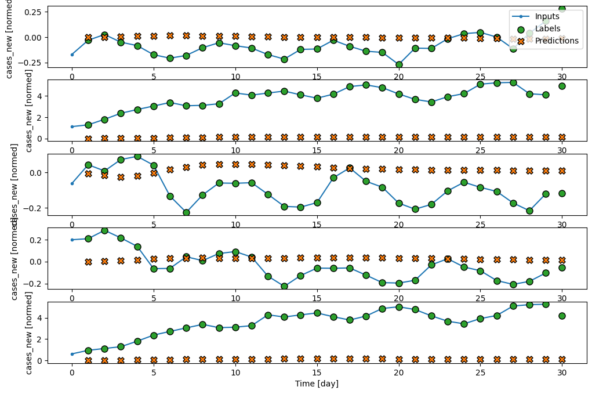

# LSTM Model Architecture

This repository contains a sequential LSTM model implemented using TensorFlow/Keras. The model consists of multiple LSTM layers with varying units to capture temporal dependencies in sequential data.

## Project Context

The year 2020 was a catastrophic year for humanity. Pneumonia of unknown etiology was first reported in December 2019, and since then, COVID-19 spread worldwide, becoming a global pandemic. More than 200 countries were affected, and governments attempted to save lives by imposing travel restrictions, quarantines, social distancing, event postponements, and lockdowns to control the spread of the virus. However, due to various challenges, these efforts were not always successful, leading to a widespread outbreak and loss of lives.

Scientists believe that the absence of AI-assisted automated tracking and prediction systems contributed to the rapid spread of COVID-19. As a result, deep learning models were proposed to predict daily COVID-19 cases and help policymakers decide on travel bans and other preventive measures. 

This project aims to develop a deep learning model using an LSTM neural network to predict new COVID-19 cases in Malaysia based on the past 30 days of case data.

Source: [MoH Malaysia COVID-19 Public Data](https://github.com/MoH-Malaysia/covid19-public)

## Model Architecture

The architecture consists of five stacked LSTM layers with the following configuration:

```python
import tensorflow as tf
from tensorflow import keras

model = keras.Sequential()
model.add(keras.layers.LSTM(units=16, return_sequences=True))
model.add(keras.layers.LSTM(units=32, return_sequences=True))
model.add(keras.layers.LSTM(units=64, return_sequences=True))
model.add(keras.layers.LSTM(units=32, return_sequences=True))
model.add(keras.layers.LSTM(units=16, return_sequences=True))

model.summary()
```

## Data Loading & Preprocessing

The dataset used for training is from Malaysian COVID-19 cases. Data preprocessing steps include:
- Loading training and test datasets from CSV files.
- Handling missing values using `SimpleImputer` from `sklearn`.
- Converting non-numeric values where necessary.

```python
import pandas as pd
from sklearn.impute import SimpleImputer

train_d = pd.read_csv("dataset/cases_malaysia_train.csv", index_col="date")
test_d = pd.read_csv("dataset/cases_malaysia_test.csv", index_col="date")

# Handle missing values in test data
test_d = pd.DataFrame(SimpleImputer(strategy='mean').fit_transform(test_d), columns=train_d.columns)
```

## Requirements
Ensure you have the following dependencies installed:

```bash
pip install tensorflow pandas numpy scikit-learn matplotlib mlflow
```

## Usage
You can integrate this model into your project as follows:

```python
# Compile the model
model.compile(optimizer='adam', loss='mse')

# Train the model
model.fit(X_train, y_train, epochs=50, batch_size=32)
```

## Performance 
Below is the model's single-step prediction using 30 days data.



## License
This project is open-source and available under the MIT License.

