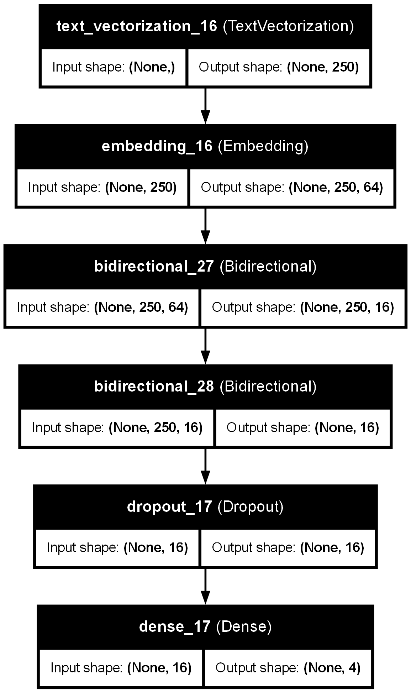
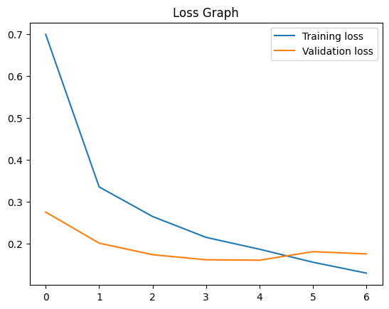
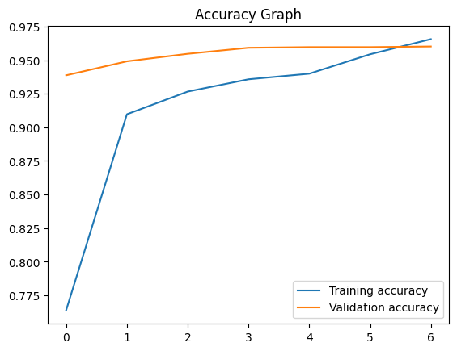

# E-commerce Product Categorization using NLP

## 📌 Project Overview
This project aims to automate the categorization of e-commerce products using **Natural Language Processing (NLP)** and **Machine Learning**. By leveraging an **RNN-based model (Bidirectional LSTM)**, we classify unseen product descriptions into four categories:

- **Electronics**
- **Household**
- **Books**
- **Clothing & Accessories**

Manual categorization of products is time-consuming and inefficient. This solution provides an automated approach, reducing human effort and improving efficiency.

## 📂 Dataset
The dataset used in this project is sourced from Kaggle:
🔗 [E-commerce Text Classification Dataset](https://www.kaggle.com/datasets/saurabhshahane/ecommerce-text-classification)

## 🔧 Required Modules
Ensure the following modules are installed before running the project:
- `os`
- `numpy`
- `pandas`
- `sklearn`
- `tensorflow`
- `keras`
- `mlflow`
- `matplotlib`
- `pickle`

## 🏗 Model Architecture
The model consists of:
- **Text Vectorization** (Tokenization)
- **Word Embedding Layer** (64-dimension)
- **Bidirectional LSTM Layers**
- **Dropout Layer (0.5)**
- **Dense Output Layer** with Softmax Activation

## 📊 Evaluation Metrics
The model is evaluated using:
- **Accuracy**
- **F1 Score** (Micro, Macro, Weighted)
- **Loss Curve & Accuracy Curve Visualization**

## 🚀 Results
The trained model achieves high accuracy in classifying products into the respective categories. The loss and accuracy curves are plotted to analyze model performance.

F1 score per class: [0.96885617 0.97413793 0.95834638 0.9420155 ]
Micro-average F1 score: 0.9603263477843546
Macro-average F1 score: 0.9608389974407663
Weighted-average F1 score: 0.9602275514115507

## 📁 Model Saving
The trained model and label encoder are saved as:
- `models/model.pkl` (Trained Model)
- `models/encoder.pkl` (Label Encoder)

## 💡 Author
Developed by **SholinADM** as part of my Capstone project. 🚀

