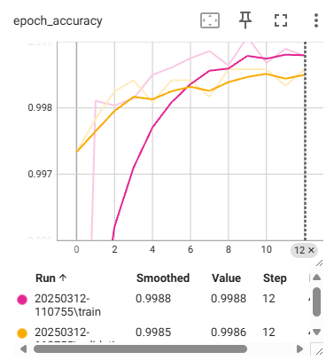
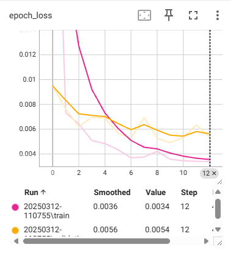

# Concrete Crack Classification

## Overview

Concrete cracks can pose significant risks to the structural integrity and safety of buildings. There are several types of common concrete cracks, including:

- **Hairline Cracks**: Develop as the concrete cures.
- **Shrinkage Cracks**: Occur during the curing process.
- **Settlement Cracks**: Result from improperly compacted ground or sinking concrete.
- **Structural Cracks**: Caused by incorrect design or excessive loads.

This project utilizes deep learning to classify concrete surfaces with or without cracks using image classification techniques. By automating crack detection, this model can help prevent structural failures and save lives.

## Getting Started

### Prerequisites

Ensure you have Python installed along with the following required modules:

- `tensorflow`
- `keras`
- `numpy`
- `opencv-python`
- `scikit-learn`
- `matplotlib`
- `datetime`
- `streamlit`

You can install them using:

```sh
pip install tensorflow keras numpy opencv-python scikit-learn matplotlib datetime streamlit
```

### Dataset

The dataset is located in the `dataset/Concrete Crack Images for Classification` directory. It consists of images of concrete with and without cracks.

### Training the Model

Run the following command to train the model:

```sh
python main.py
```

This will:

1. Load and preprocess the dataset.
2. Apply data augmentation.
3. Use transfer learning with MobileNetV2.
4. Train and evaluate the model.
5. Save the trained model in the `models/` directory.

 Alternatively, use a Python IDE like VS Code or Spyder.

### Running the Streamlit App

Once the model is trained, navigate to the app directory and launch the Streamlit app to classify new images:

```sh
cd path <directory path>
```

```sh
streamlit run App.py
```

This provides a simple UI for users to upload images and receive classification results.

## Model Architecture

- **Backbone Model**: MobileNetV2 (pretrained on ImageNet)
- **Data Augmentation**: Random flip, rotation
- **Optimizer**: Adam
- **Loss Function**: Sparse Categorical Crossentropy


## Results

During training, TensorBoard logs are generated in the `logs/` directory. The following graphs are plotted:

- **Loss Graph**: Training vs. Validation Loss
- **Accuracy Graph**: Training vs. Validation Accuracy




## Contribution

Suggestions for improvements are always welcome! The dataset used in this project can be accessed at [Mendeley Data](https://data.mendeley.com/datasets/5y9wdsg2zt/2).

## Author
Developed by **SholinADM** as part of my Capstone project. 🚀

