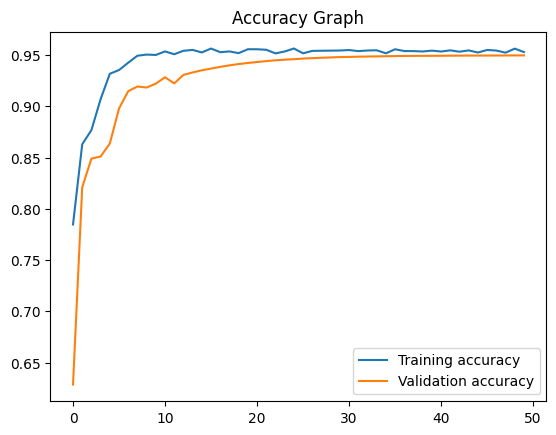
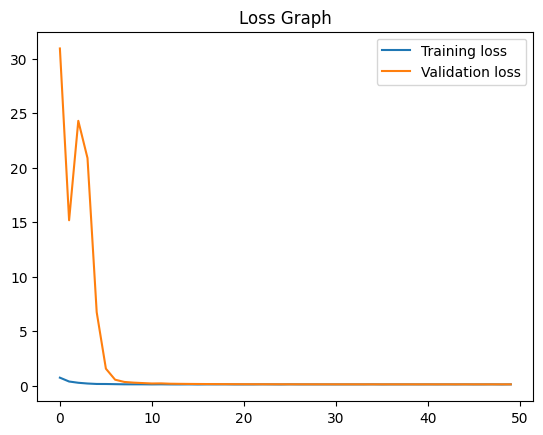

# Nuclei Detection for Biomedical Research

An AI-powered algorithm designed for the automated detection of cell nuclei in images. This tool aims to expedite research on a wide range of diseases such as cancer, heart disease, Alzheimer's, and chronic obstructive pulmonary disease. By streamlining the process of identifying cell nuclei, it enables researchers to analyze DNA and examine cellular responses to various treatments, helping accelerate the development of new cures.

## Overview

This project focuses on semantic segmentation for images containing cell nuclei using a deep learning model. The model utilizes a UNet architecture with a MobileNetV2 backbone to extract features and generate accurate segmentation masks.

### Key Features
- **AI-driven nuclei detection**: Automates the process of detecting nuclei in biomedical images.
- **Deep learning-based segmentation**: Uses a UNet architecture for semantic segmentation of cell nuclei.
- **Speeding up drug discovery**: Enables faster drug testing by analyzing cell responses to treatments.
- **Flexibility for various diseases**: Applicable to research in cancer, Alzheimer's, diabetes, and other diseases.

### 🔧 Prerequisites

Ensure you have Python installed along with the following required modules:

- `tensorflow`
- `keras`
- `opencv-python`
- `matplotlib`
- `numpy`
- `IPython`

You can install the required packages using pip:

```bash
pip install tensorflow keras opencv-python matplotlib numpy ipython
```

## Model Architecture
The model uses a **UNet architecture** with a **MobileNetV2** backbone. It performs semantic segmentation by predicting pixel-level classification for each image.

### 📂 Dataset

The dataset is too large to be included in the directory. The dataset can instead be downloaded from [Data Science Bowl 2018.](https://www.kaggle.com/competitions/data-science-bowl-2018/overview)

### 🔧 Training the Model

Run the following command to train the model:

```sh
python main.py
```

Alternatively, use a Python IDE like VS Code or Spyder.

## 🚀 Results

During training, TensorBoard logs are generated in the `logs/` directory. The following graphs are plotted:

- **Loss Graph**: Training vs. Validation Loss
- **Accuracy Graph**: Training vs. Validation Accuracy




## 💡 Author
Developed by **SholinADM** as part of my Capstone project.
